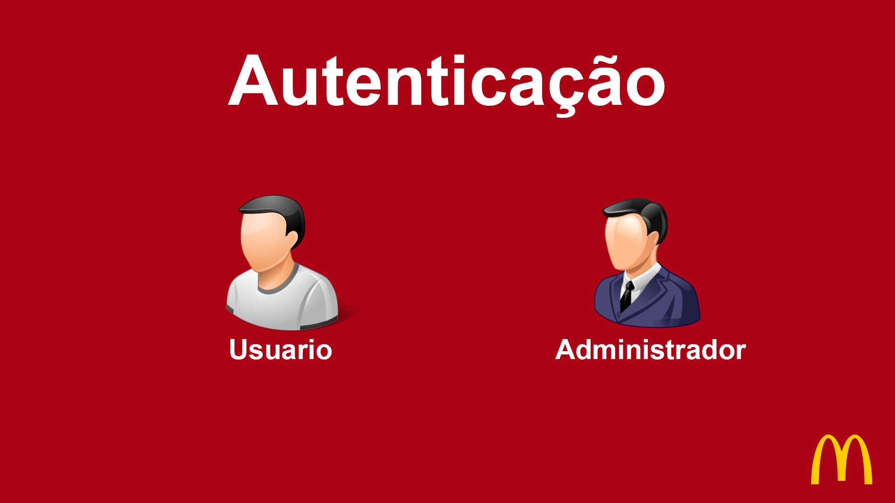
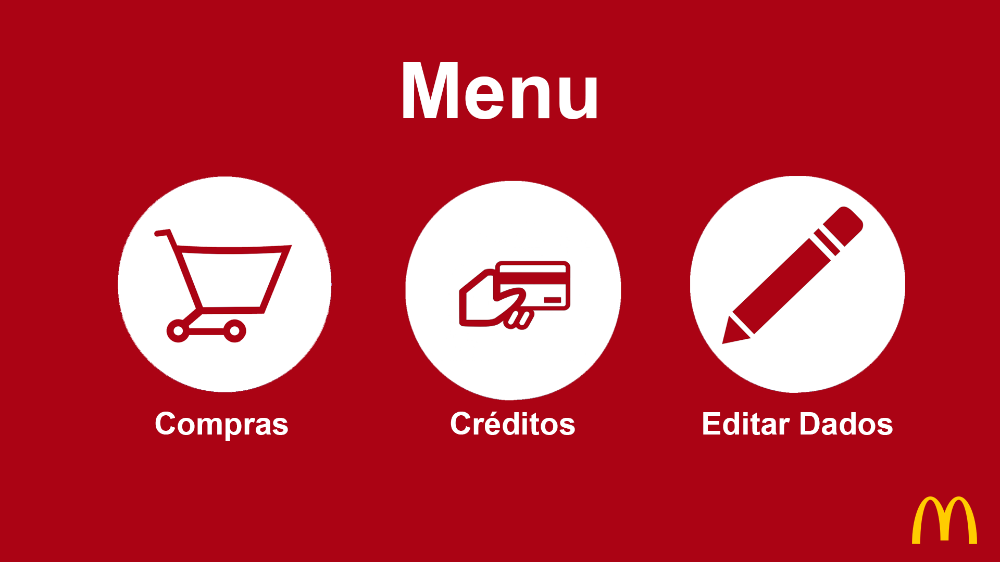
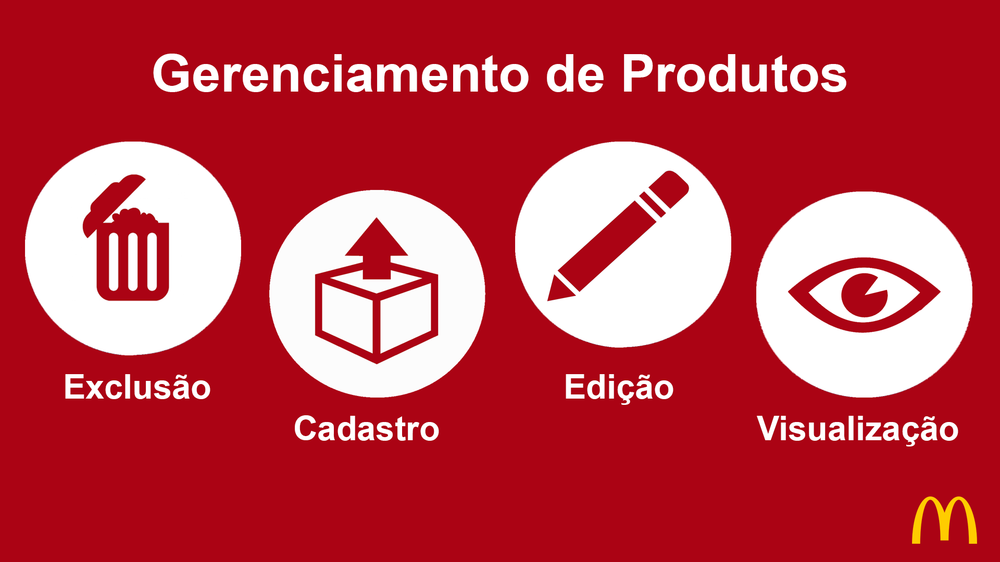
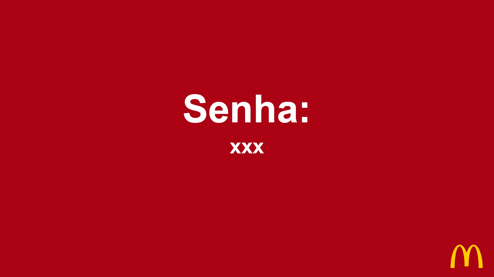

# **McDonald's Self-Service Kiosk - `JavaFX`**

### **[ACESSE O CÓDIGO FONTE ->](https://github.com/arthur-amx/McDonalds-Self-Service-Kiosk-JavaFX)**



---

## **1. Descrição do Projeto (System Overview)**

Este projeto é uma simulação imersiva de um **totem de autoatendimento**, inspirado na interface da multinacional McDonald's. Originalmente concebido em 2017 e refatorado para tecnologias modernas, o sistema opera como uma aplicação Desktop robusta.

O objetivo é demonstrar a arquitetura de uma aplicação comercial completa, integrando uma UI rica (JavaFX) com lógica de controle de acesso, fluxo de pedidos e integrações externas (E-mail, Facebook API e Pagamentos), oferecendo uma experiência fluida tanto para o cliente quanto para o administrador.

### **Galeria do Sistema**
<div style="display: flex; gap: 10px;">
  
  
  
</div>

## **2. Pilha de Tecnologias (Core Stack)**

A arquitetura do sistema foi modernizada utilizando as seguintes tecnologias:

#### **Core & Interface**


#### **Build & Dependências**


#### **Integrações & Bibliotecas**


-1877F2?style=for-the-badge&logo=facebook&logoColor=white)


---

## **3. Estrutura de Diretórios (System Architecture)**

```text
McDonaldTablet/
├── src/
│   ├── main/
│   │   ├── java/app/            # Lógica de Negócio (Controllers, Models)
│   │   │   ├── Launcher.java    # Bootloader (Resolve dependências JavaFX)
│   │   │   └── Main.java        # Entry Point da Aplicação
│   │   └── resources/           # Assets Visuais
│   │       ├── viewFXML/        # Telas (Interface XML)
│   │       ├── imgs/            # Ícones e Imagens
│   │       └── styles/          # Estilização CSS
├── Telas/                       # Screenshots da Documentação
├── pom.xml                      # Gerenciador de Dependências Maven
└── README.md
```

## **4. Execução Local (Local Deployment)**

Para clonar e rodar este projeto em seu ambiente local, siga os passos abaixo.

**Pré-requisitos:**
*   Java JDK 21+
*   Maven
*   IntelliJ IDEA

**Passo 1: Clone o repositório**
```bash
git clone https://github.com/arthur-amx/McDonalds-Self-Service-Kiosk-JavaFX.git
cd McDonalds-Self-Service-Kiosk-JavaFX
```

**Passo 2: Instale as dependências**
O projeto utiliza Maven para gerenciar bibliotecas. Na raiz do projeto, execute:
```bash
mvn clean install
```

**Passo 3: Execute a Aplicação**
Para evitar conflitos de módulos do JavaFX, execute sempre através da classe lançadora:

**Via Terminal:**
```bash
mvn javafx:run
```

**Via IntelliJ:**
1. Navegue até `src/main/java/app/Launcher.java`.
2. Clique no ícone de **Play** verde ao lado da linha `public class Launcher`.
